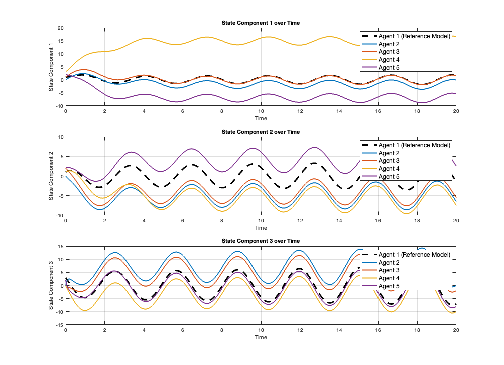

# Robust Adaptive Control for Multi-Agent Systems

## Overview
Implementation of robust adaptive control strategies for multi-agent systems, addressing consensus challenges and sensor uncertainties. The project develops distributed control architectures for both time-invariant and time-varying uncertainties in networked systems.

## Key Features
- Consensus protocol implementation for multi-agent systems
- Distributed adaptive control architectures
- Handling of time-invariant and time-varying uncertainties
- Neural-adaptive control with exogenous signals
- Comprehensive numerical simulations

## Mathematical Framework
- Basic consensus protocol: `ẋ(t) = -Lx(t)`
- Dynamic system model: `ẋᵢ(t) = Axᵢ(t) + Buᵢ(t)`
- Adaptive estimation for uncertainties
- Stability analysis using Lyapunov functions

## Results
The implementation demonstrates:

- (project_timevariant_Recovery.png)
- Effective handling of sensor uncertainties
- Robust performance under various conditions
- Error dynamics with different noise types (Gaussian, Brownian)

## Numerical Examples
- Basic consensus protocol simulation
- Dynamic multi-agent system with leader-follower topology
- Time-invariant uncertainty compensation
- Time-varying uncertainty mitigation

## Requirements
- MATLAB R2019b or later
- Control System Toolbox
- Simulink (optional)

## Usage
1. Clone the repository
2. Run the main simulation scripts
3. Modify parameters as needed for different scenarios

## Author
Haowei(Alice) Chen
- GitHub: [@alicechen216](https://github.com/alicechen216)
- Email: haoweichen@usf.edu

## License
MIT License

## Acknowledgments
University of South Florida, Department of Mathematics & Statistics
